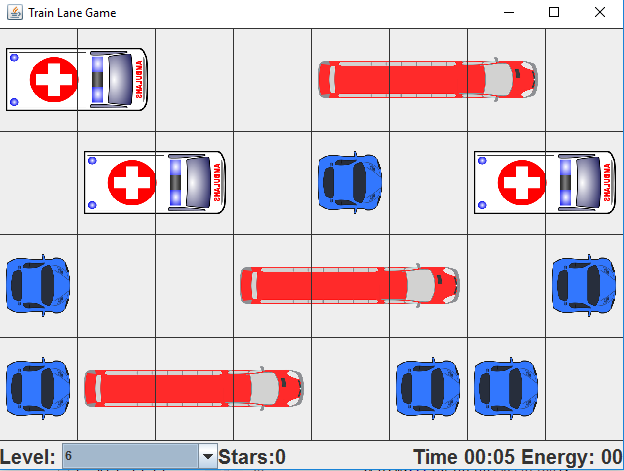
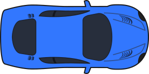
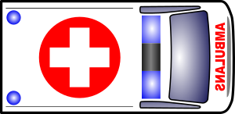
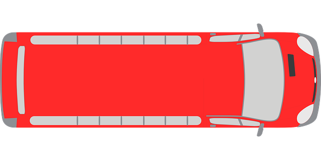
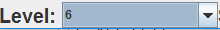

## Abrir paso a la vía del tren

Este es un videojuego de lógica con la siguiente temática.
Una compañía de construcción ferroviaria debe tender una línea entre varios países.
En el camino se encuentran con varios obstáculos que deben moverse para que la línea del tren pueda pasar.

El jugador debe mover horizontalmente la menor cantidad de obstáculos (vehículos) de tal forma de que la línea del tren pueda pasar verticalmente por alguna de las columnas.
Para mover un obstáculo, el jugador lo selecciona y hace clic en alguna de las casillas de los lados para moverlo a la izquierda o a la derecha.
Un obstáculo sólo puede moverse a un espacio vacío a la vez.
Mover un obstáculo tiene su costo.
Por ejemplo, un vehículo pequeño, para moverlo un espacio, cuesta una unidad de energía.
Dado que en la historia del juego el problema es muy frecuente (hay muchos niveles), la compañía constructora contrata al jugador para que minimice la cantidad de energía que la compañía deba invertir y conseguir tender los rieles entre todos los países.

La solución no siempre es la columna que tiene más espacios vacíos.
Pueden haber casos en los que hay dos columnas con la misma cantidad de espacios vacíos, pero una consume menos energía que la otra.

Cada nivel le dará una calificación al jugador de acuerdo a su desempeño al ahorrarle energía a la compañía.
Se hará en una escala de 0 a 3 estrellas y el jugador las obtendrá de la siguiente manera:

- 3 estrellas si termina el nivel de manera óptima, con la mínima cantidad de energía necesaria para terminar el nivel.

- 2 estrellas si termina el nivel con solo uno más de energía utilizada que la solución óptima.

- 1 estrella si termina el nivel con solo dos más de energía utilizada que la solución óptima.

- 0 estrellas si consume tres o más de energía que la solución óptima.

Este es un ejemplo de la ventana principal del juego:

El juego tiene tres tipos de obstáculos:

- Los carros: moverlos consume solo uno de energía y ocupan solo una celda. Se ven de la siguiente manera:

- Las ambulancias: moverlas consume dos de energía y ocupan dos celdas. Se ven de la siguiente manera:

- Los buses: moverlos consume tres de energía y ocupan tres celdas. Se ven de la siguiente manera:

El jugador cuenta con la posibilidad de escoger el nivel que guste, al seleccionar en una lista en la esquina inferior izquierda de la ventana:

